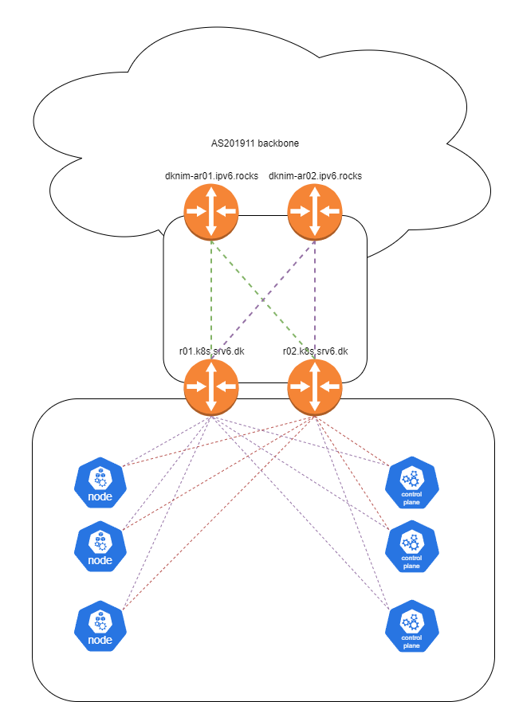

# IPv6 only kubernetes network overview - Cilium, VyOS, BGP
The kubernetes lab uses Cilium as the CNI, in this deployment Cilium is running IPv6 only in native-routing mode with BGP peerings to two virtual VYOS routers acting as essentially a mix between TOR switches and a CE router for my personal ASN AS201911.

Cilium was chosen as the CNI due to the following reasons
- Excelent BGP support
- Interesting observability tools though Hubble
- High performance due to eBPF
- Great support for network policies
- Support for advanced networking features i might want to checkout like srv6 in k8s
- Built in gateway API and ingress

See diagram below for a vistual representation



## Addressing
Due to running IPv6 only in my own ASN, i have assigned a /48 network to this k8s lab.

Some of the plan looks the way it does due to previously being part of a shared /48 network with other lab infra, cleaning up the IP plan is todo point for a time where the cluster is down anyways.

The addressing plan looks as follows

|Prefix|Location|Use|
|--|--|--|
|2a0e:97c0:ae3::/48|Lab|Assigned Aggregate|
|2a0e:97c0:ae3:c100::/112|Cluster|K8S Service subnet|
|2a0e:97c0:ae3:c200::/56|Cluster|K8S PodCIDR|
|2a0e:97c0:ae3:c401::/64|Cluster|K8S Cilium LB IP pool|
|2a0e:97c0:ae3:fff0::/64|Vlan 2502 - K8S Node network|Node IP's|
|2a0e:97c0:ae3:ffff::/64|Loopback aggregates|Assigned Aggregate|
|2a0e:97c0:ae3:ffff::1/128|r01.k8s.srv6.dk|MGMT Loopback|
|2a0e:97c0:ae3:ffff::2/128|r02.k8s.srv6.dk|MGMT Loopback|

## Cilium configuration
Cilium is installed doing setup of the cluster, for more information about that see [Cluster setup](../deployment/setup_cluster.md) and [patch_infra.sh script](https://github.com/AndersBallegaard/homelab-k8s/blob/main/admin/patch_infra.sh)

For configuration related parameters, I am using a kustomization deployed by fluxcd to manage it. This choice have been made in order to have as much declaritive, easy to manage configuration as posible.

### Loadbalancer pools
The cluster needs external IP's to assign to any service of the type loadBalancer, given i have an ipv6 only cluster with my own address space, the most obivious choice was to use global ipv6 in this case, but you can absolutly find other solutions if that's not posible for your setup.
```yaml
# cluster/infra/cilium/lb-ipam.yaml
apiVersion: "cilium.io/v2alpha1"
kind: CiliumLoadBalancerIPPool
metadata:
  name: "lb-pool"
spec:
  blocks:
  - cidr: "2a0e:97c0:ae3:c401::/64"
```

### BGP Configuration
Let's look at the general BGP setup.
There is quite a lot going on here, but in it basicly just does the following
* Creates a BGP "Cluster" called cilium-bgp, and provisions it on all nodes
* Specifies that the local-as is 65500
* Sets up peerings to R01.k8s.srv6.dk and R02.k8s.srv6.dk
* Creates a CiliumBGPPeerConfig (Peer group) specifying that ipv6 unicast is the only family enabled, and setting a password
```yaml
# cluster/infra/cilium/bgp.yaml
apiVersion: cilium.io/v2alpha1
kind: CiliumBGPClusterConfig
metadata:
  name: cilium-bgp
  namespace: kube-system
spec:
  nodeSelector:
    matchLabels:
      kubernetes.io/os: linux
  bgpInstances:
  - name: "instance-65500"
    localASN: 65500
    peers:
    - name: "r01"
      peerASN: 65666
      peerAddress: 2a0e:97c0:ae3:fff0::1
      peerConfigRef:
        name: "cilium-peer"
    - name: "r02"
      peerASN: 65666
      peerAddress: 2a0e:97c0:ae3:fff0::2
      peerConfigRef:
        name: "cilium-peer"
    
---
apiVersion: cilium.io/v2alpha1
kind: CiliumBGPPeerConfig
metadata:
  name: cilium-peer
  namespace: kube-system
spec:
  authSecretRef: bgp-auth-secret
  timers:
    holdTimeSeconds: 9
    keepAliveTimeSeconds: 3
  ebgpMultihop: 4
  gracefulRestart:
    enabled: true
    restartTimeSeconds: 15
  families:
    - afi: ipv6
      safi: unicast
      advertisements:
        matchLabels:
          advertise: bgp
```
NOTE: This uses the BGP secret set during cluster setup, please make sure the password accually matches.

NOTE: Under cluster setup **anotate-nodes.sh** was executed in the background, this script sets router-id's on a list of nodes. If some nodes won't peer check that a router-id have been set

### Create annoncements
Ok, we are not quite done with the BGP configuration, we still needs to specify what to announce. 

In my example due to running cilium in native-routing mode, i want to advertise everything i know. For this reason i am creating two CiliumBGPAdvertisement objects bellow advertising the following

* ExternalIP
* LoadBalancerIP
* ClusterIP
* PodCIDR
```yaml
# cluster/infra/cilium/advertisements.yaml
---
apiVersion: cilium.io/v2alpha1
kind: CiliumBGPAdvertisement
metadata:
  labels:
    advertise: bgp
  name: bgp-advertisements
spec:
  advertisements:
  - advertisementType: Service
    selector:
      matchExpressions:
      - key: somekey  # For some reason this works, and things break if i remove it, no this key does not exist anywhere
        operator: NotIn
        values:
        - never-used-value
    service:
      addresses:
      - ExternalIP
      - LoadBalancerIP
      - ClusterIP
---
apiVersion: cilium.io/v2alpha1
kind: CiliumBGPAdvertisement
metadata:
  name: bgp-advertisements-podcidr
  labels:
    advertise: bgp
spec:
  advertisements:
    - advertisementType: "PodCIDR"
      attributes:
        communities:
          standard: [ "65000:99" ]
        localPreference: 99
```

### Building the kustomization
Let's put it all togther in a simple kustomization
```yaml
# cluster/infra/cilium/kustomization.yaml
apiVersion: kustomize.config.k8s.io/v1beta1
kind: Kustomization
metadata:
  name: cillium-config
resources:
  - https://raw.githubusercontent.com/kubernetes-sigs/gateway-api/v0.5.1/config/crd/standard/gateway.networking.k8s.io_gatewayclasses.yaml
  - https://raw.githubusercontent.com/kubernetes-sigs/gateway-api/v0.5.1/config/crd/standard/gateway.networking.k8s.io_gateways.yaml
  - https://raw.githubusercontent.com/kubernetes-sigs/gateway-api/v0.5.1/config/crd/standard/gateway.networking.k8s.io_httproutes.yaml
  - https://raw.githubusercontent.com/kubernetes-sigs/gateway-api/v0.5.1/config/crd/experimental/gateway.networking.k8s.io_referencegrants.yaml
  - lb-ipam.yaml
  - bgp.yaml
  - advertisements.yaml
```


## Router configuration
See [VYOS Configuration](vyos.md)


---
This page is autogenerated, do not edit it directly [see this for more information](https://homelab.anderstb.dk/info/docs/)